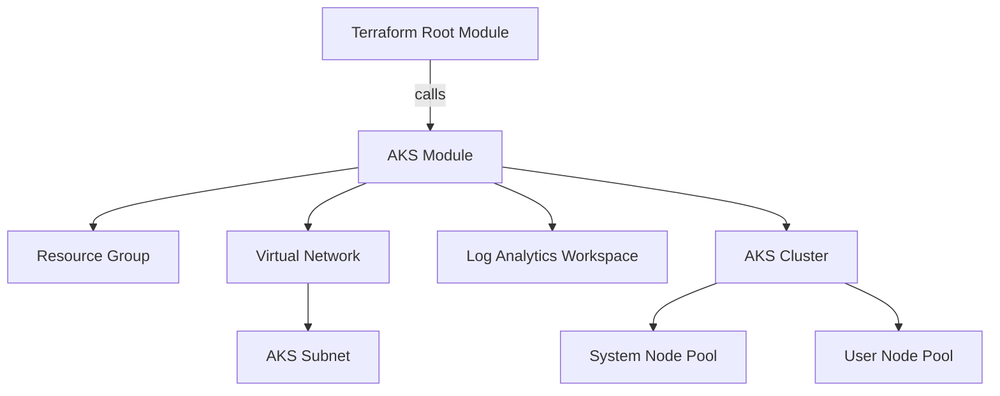
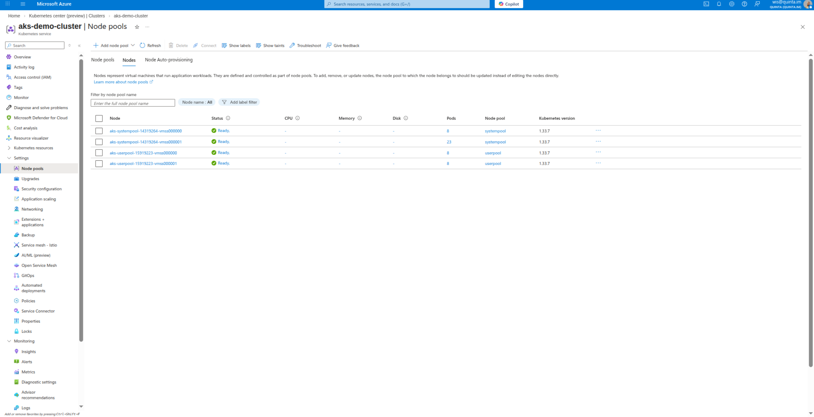

# AKS Terraform Portfolio

## Overview
This project demonstrates a robust, production-ready approach to provisioning Azure Kubernetes Service (AKS) using Terraform. It follows best practices for modularity, security, scalability, and maintainability, making it suitable for both demo and enterprise environments.

---

## Features
- **Modular Structure:**
  - Root and module separation for reusability and clarity
  - Parameterized for easy customization
- **Secure Azure Authentication:**
  - Uses environment variables for ARM credentials
- **Network Best Practices:**
  - Custom VNet and subnet
  - Non-overlapping service and subnet CIDRs
- **Scalable Node Pools:**
  - System and user node pools with auto-scaling
- **Monitoring & Governance:**
  - Log Analytics integration
  - Azure Policy enabled
- **Tagging & Cost Management:**
  - Rich tagging for environment, project, and ownership
- **Documentation & Screenshots:**
  - Step-by-step deployment guide
  - Screenshots of plan and apply

---

## Architecture


---

## Quick Start
1. **Clone the repo**
2. **Set Azure credentials:**
   ```sh
   export ARM_CLIENT_ID="<client-id>"
   export ARM_CLIENT_SECRET="<client-secret>"
   export ARM_TENANT_ID="<tenant-id>"
   export ARM_SUBSCRIPTION_ID="<subscription-id>"
   ```
3. **Edit `terraform.tfvars`** with your values
4. **Initialize Terraform:**
   ```sh
   terraform init
   ```
5. **Dry run:**
   ```sh
   terraform plan
   ```
6. **Apply:**
   ```sh
   terraform apply
   ```

---


## Results

### AKS Overview Result


### AKS Nodes Result


---

## Troubleshooting
- **Resource Already Exists:** Import with `terraform import` if a resource is pre-existing.
- **CIDR Overlap:** Ensure `service_cidr` does not overlap with subnet CIDRs.
- **Provider Issues:** Run `terraform init -upgrade` to refresh providers.

---

## Best Practices
- Use remote state for team/CI/CD scenarios
- Pin provider and Kubernetes versions
- Enable private cluster mode for production
- Regularly review Azure and Terraform security guidance

---

## Author
ISMAIL WAJDI — Provisioning AKS Demo

---

## License
MIT
